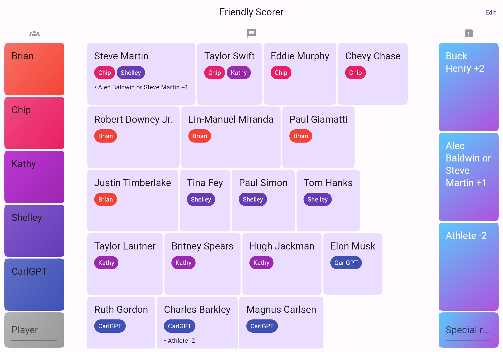
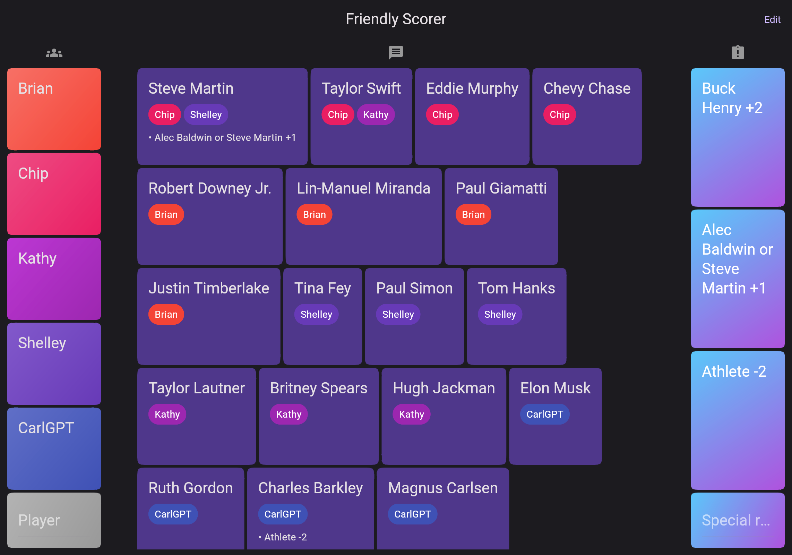
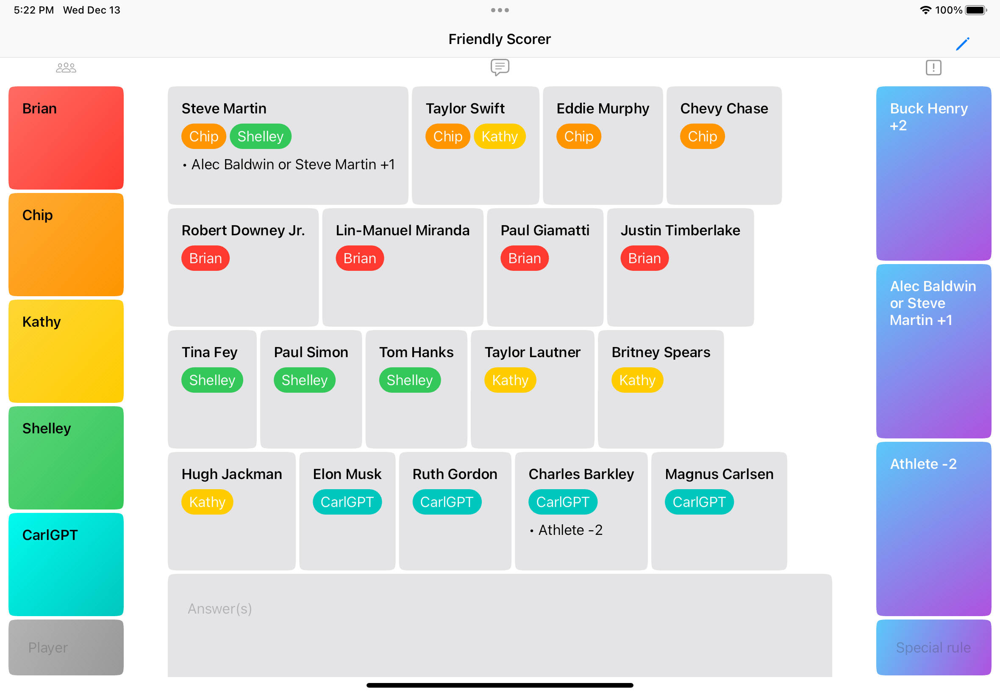
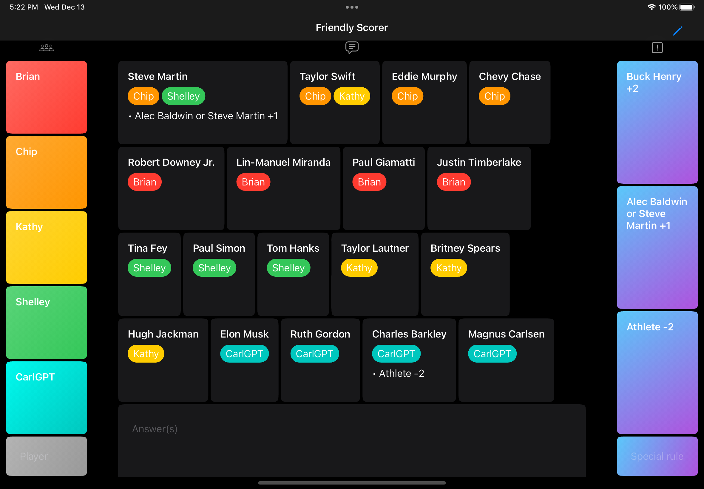
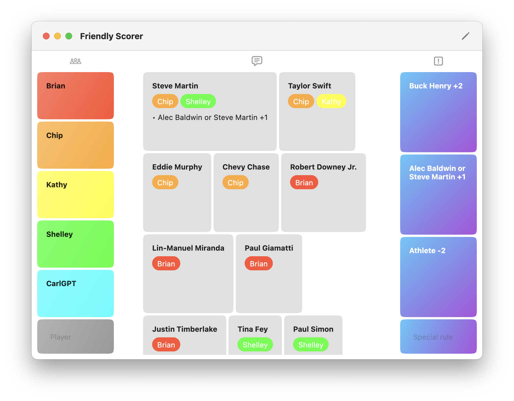
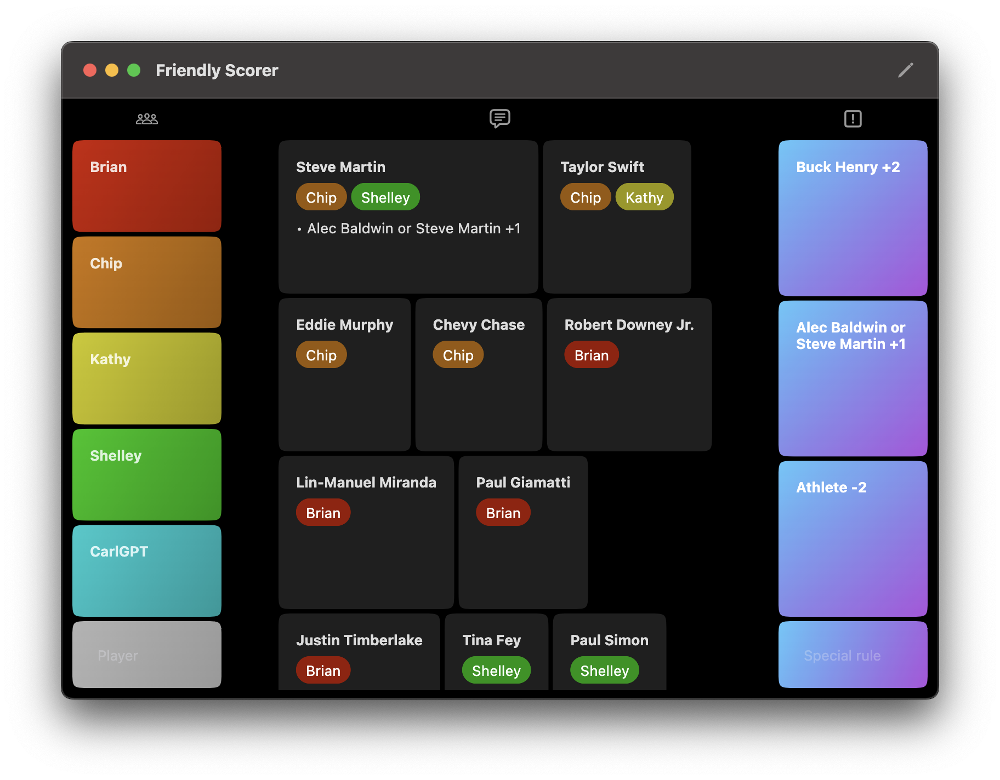

# Friendly Scorer

A scoreboard for a single round of [Friendly Competition](https://www.theincomparable.com/gameshow/friendly/).

Friendly Scorer hosted as a web app: https://friendlyscorer.web.app/

## How to add answers

Add answers by typing or pasting at the bottom of the middle column. Answers can be space-, comma-, or newline-separated. Tap the row of answers that is split correctly, or press enter if you're feeling lucky (first row of answers).

> Seeking feedback about answer parsing! How are answers usually formatted from the players? Is the current answer splitting useful?

## More screenshots

Web

iOS

macOS

## Prerequisites

* Flutter: https://docs.flutter.dev/get-started/install

## Building and deploying for the web

1. `flutter build web`.
2. Deploy the contents of `./build/web` to a static web host.
  * https://friendlyscorer.web.app/ is hosted on Firebase Hosting, so `firebase deploy`.
